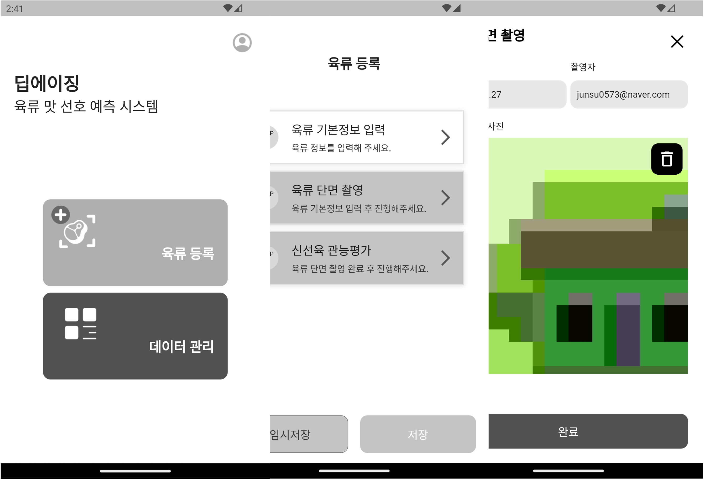
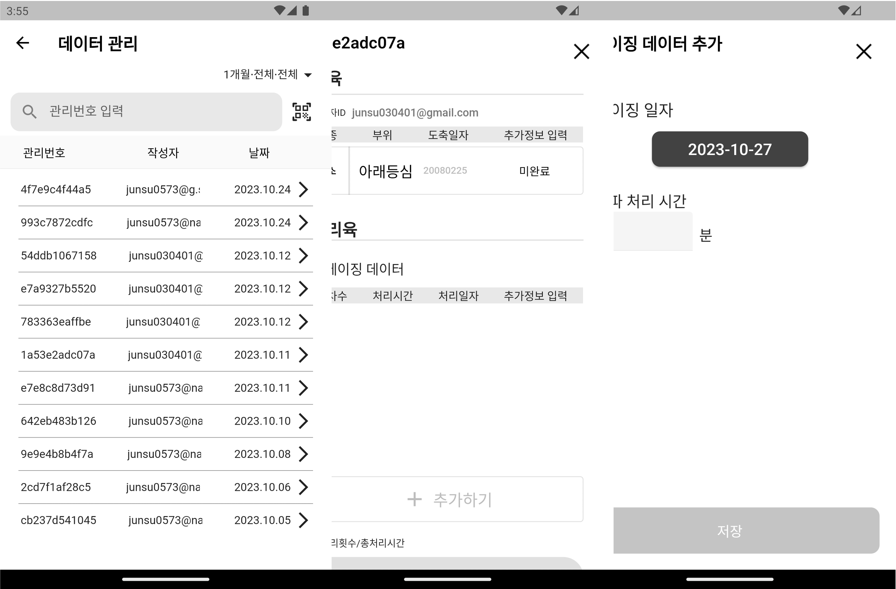

# DeepAging app

> 성균관대학교 산학협력프로젝트 딥플랜트1 Mobile Application
> 개발기간: 2023.03 ~ 2023.12
>
> Built with Flutter.

## Table of Contents

- [Introduction](#Introduction)
- [Features](#Features)
- [Contributors](#Contributors)
- [Build Process](#Build-Process)

## Introduction

Register data such as photos and information of meat, view the entered meat information, modify the information of that meat, or add new data.

Available for only Android.

## Features

A few ot the things you can do with DeepAging:

- Register a meat with image and some info.
- View the list of the meat information you registerd.
- Modify the information on the meat.
- Add measured data from processed meats.

## Contributers

|                            전수현 (Jeon Suhyeon)                             |                            송의영 (Song Euiyeong)                            |
| :--------------------------------------------------------------------------: | :--------------------------------------------------------------------------: |
|  |  |
|              [GitHub: @junsu0573](https://github.com/junsu0573)              |               [GitHub: @hosicuro](https://github.com/hosicuro)               |
|                      성균관대학교 소프트웨어학과 2학년                       |                      성균관대학교 소프트웨어학과 2학년                       |

## Build Process

- Follow the [Flutter Install Guide](https://docs.flutter.dev/get-started/install) for getting started building a project with flutter SDK.
- Install [Android Studio](https://developer.android.com/studio?hl=ko) and Emulator yo want from Android Studio for rendering flutter project on the emulator.
- And set the environment variable if you want to use flutter globally.
- Clone or download the repo.
- Open your emulator from Android Studio.
- `flutter pub get` to get all flutter dependencies
- `flutter start` to start the flutter app
